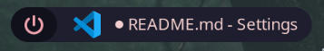
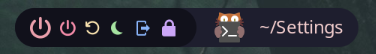
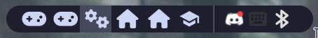
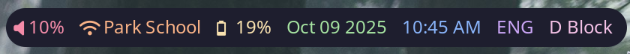
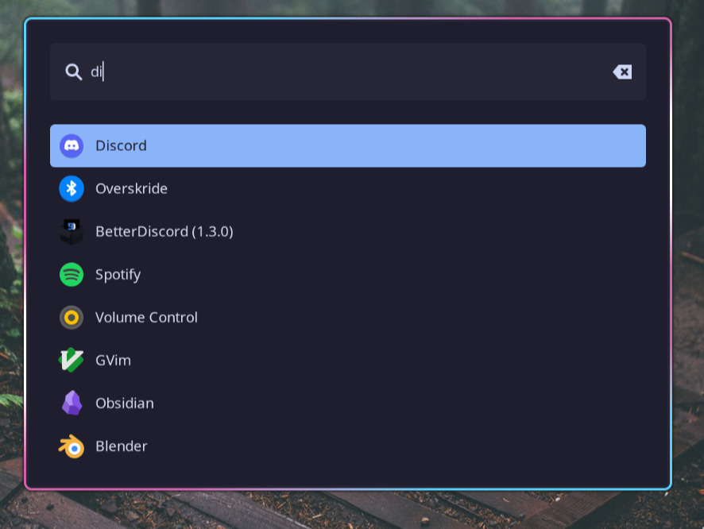

# Installation

To install the configs and apply them all to your computer, run the following code in your home directory:
```bash
git clone https://github.com/mildly-intelligent/dotfiles.git ~/Settings/
cd ~/Settings
bash ./install.sh
```

# Overview

## Hyprland

### Bindings

#### Misc
* <kbd>Meta</kbd>+<kbd>⇧ Shift</kbd>+<kbd>C</kbd> - Reload Hyprland
* <kbd>PrtSc</kbd> - Take screenshot
* <kbd>CapsLock</kbd><sup>†</sup> - Switch keyboard via fcitx5

#### Window Control
* <kbd>Meta</kbd>+<kbd>⇧ Shift</kbd>+<kbd>Q</kbd> - Close active window
* <kbd>Meta</kbd>+<kbd>⌃ Ctrl</kbd>+<kbd>F</kbd> - Fullscreens the current window
* <kbd>Meta</kbd>+<kbd>LMB</kbd>+Drag - Move window
* <kbd>Meta</kbd>+<kbd>RMB</kbd>+Drag - Resize window
* <kbd>Meta</kbd>+<kbd>MMB</kbd> - Toggle tiling

#### Application Launching

* <kbd>Meta</kbd>+<kbd>Space</kbd> - Open the application launcher (Wofi)
* <kbd>Meta</kbd>+<kbd>B</kbd> - Open browser (Firefox)
* <kbd>Meta</kbd>+<kbd>C</kbd> - Open VSCode
* <kbd>Meta</kbd>+<kbd>⎇ Alt</kbd>+<kbd>C</kbd> - Open FRC VSCode
* <kbd>Meta</kbd>+<kbd>D</kbd> - Open Discord
* <kbd>Meta</kbd>+<kbd>F</kbd> - Open files (Nemo)
* <kbd>Meta</kbd>+<kbd>S</kbd> - Open Spotify
* <kbd>Meta</kbd>+<kbd>T</kbd> - Open the terminal (Kitty)

#### Workspace Switching
* <kbd>Meta</kbd>+<kbd>F1-12</kbd> - Switch to workspace #
* <kbd>Super</kbd>+<kbd>⇧ Shift</kbd>+<kbd>F1-12</kbd> - Switch to workspace # and move the active window

<sup>†</sup> The <kbd>CapsLock</kbd> key is remapped to the now unused <kbd>Hyper</kbd> key from the [Space-Cadet keyboard](https://en.wikipedia.org/wiki/Space-cadet_keyboard). This key can be used as a modifier and likely will in the future.

### Gestures

Please note gestures are split between `./Hyprland/gestures.conf` and `./Misc/Gestures`. The former being for gestures builtin to Hyprland whilst the latter is for custom gestures.

#### 3 Finger
These gestures relate to the Window Manager.

* Swipe left/right* - Switch workspaces to the left or right.
* Pinch in* - Closes the active window.
* Pinch out* - Toggles fullscreen for the active window.
* Tap<sup>†</sup> - Opens the application launcher (Wofi).

#### 4 Finger
These gestures relate to audio control.

* Swipe left/right - Go to the previous/next song in the track.
* Swipe up/down - Increase/decrease the volume by 10%.
* Tap<sup>†</sup> - Plays or pauses the current song.

\* These gestures are located at `./Hyprland/gestures.conf`.

<sup>†</sup> Tap requires leaving your fingers on the trackpad for a short amount of time.

### Hyprlock

The lock screen features four things:
1. The current date
0. The time of day
0. Password bar, you can either enter your password, or press <kbd>Enter</kbd> to use fingerprint login
0. Battery percentage and weather or not it's charging


## Waybar

Waybar is a status bar giving quick access to critical information, it is broken up into three sections.

### Left Modules


#### Power Buttons
Upon hover this gives you the options to, in order, shutdown, restart, or sleep the computer, logout of Hyprland, or open Hyprlock.



#### Window
This shows the window's icon and name.

### Center Modules


#### Workspaces
This shows all active workspaces 1-12, there are four types of workspaces designated by the icons, three for recreation, one for configuration, four for home, and four for school.

#### Tray
Some applications such as Discord or Fcixt5 will display an icon in the tray which can be right clicked for additional options.

### Right Modules


#### Volume
Shows the volume and, when something is playing, a audio visualizer.

#### Wifi
Shows the signal strength and SSID.

#### Battery
Shows the battery percentage alongside charging status and, upon hover, time till empty/full.

#### Date/Time
Shows the date and time.

#### Keyboard
Shows the keyboard being used by Fcixt5, for me either ENG or 中文.


## Wofi



The application launcher to launch any app that doesn't have a specified keybind. There is a search bar to find any application.

## Battery

This is a script that will run on loop and send a notification when the battery discharges to 20%, 10% and 5%.

### Low

This notification is located in the top right of the screen along side other non-battery related notifications.


### Very Low

This notification is located in the center of the screen.


### Critical

This notification is located in the center of the screen.

